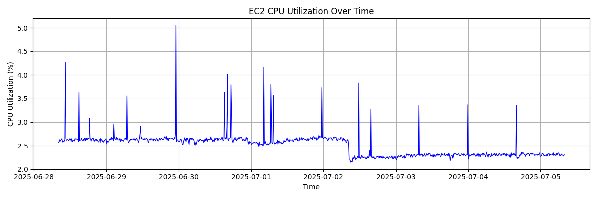
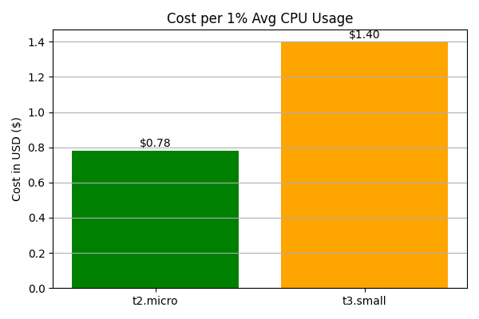

# 📊 EC2 Cost Optimization Dashboard

An interactive dashboard that analyzes resource utilization, network throughput, and cost-efficiency of an Amazon EC2 instance using real CloudWatch metrics. While this demo focuses on a t2.micro instance (within AWS's Free Tier), the logic is applicable to any EC2 type. Designed to help identify underutilized workloads and propose right-sizing strategies aligned with FinOps principles.
---
##  Project Overview
- Monitors **CPU usage**, **Network I/O**, and **runtime efficiency**
- Calculates **estimated billing cost** for both `t2.micro` and `t3.small`
- Provides **cost-per-CPU%** metrics to evaluate waste
- Visualized using **Dash & Plotly**
- Recommends optimal AWS pricing models (On-demand vs Reserved vs Spot)
---

## Screenshots
### CPU Utilization Over Time


### Cost Efficiency Comparison


---
##  Summary Insights
| Metric                         | Value          |
|--------------------------------|----------------|
| Monitoring Duration            | 168 hours      |
| Average CPU Utilization        | 2.5%           |
| Underutilized Runtime (<10%)   | 100%           |
| Total Network Traffic          | 1.89 MB        |
| Estimated Cost (t2.micro)      | $1.95          |
| Estimated Cost (t3.small)      | $3.49          |
| Cost per 1% CPU (t2.micro)     | $0.78          |
| Cost per 1% CPU (t3.small)     | $1.39          |

**Conclusion**: t2.micro is more cost-efficient for this workload. A switch to `t3.small` would double the cost without significantly increasing value.

---


## FinOps Insight

This project applies FinOps principles to evaluate and reduce unnecessary EC2 cloud spend:

- **Right-sizing analysis** (low CPU usage = overprovisioned)
- **Pricing model comparison** (on-demand vs reserved vs free tier)
- **Opportunity cost** of upgrading instance class vs staying lean

> **Scenario**:
> Is it cheaper to upgrade to `t3.small` for performance, or stick with a fully utilized `t2.micro`?
>
> - Run `t2.micro` for 150 hrs/month → **Free (under free tier)**
> - Run `t3.small` for 100 hrs/month → ~$25/year

> **Result**: A `t2.micro` is more cost-efficient for idle or low-load workloads. Upgrade only if consistent CPU usage exceeds 10–20%.

---

## Tech Stack
- Python 3.8+
- AWS CloudWatch & boto3
- Dash (Plotly)
- Pandas
- Matplotlib/Plotly Express (for visuals)

---
## Run Locally
Clone the repo and install dependencies:

```bash
git clone https://github.com/NgunyiGachie/ec2-cost-optimization-dashboard.git
cd ec2-cost-optimization-dashboard
pip install -r requirements.txt
python dashboard/app.py